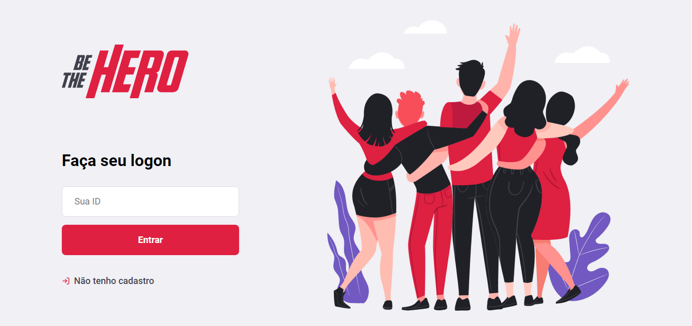

# Be The Hero

<h2>🔎 Tecnologias Utilizadas<h2>
<ul>
  <a href="https://pt-br.reactjs.org/"><li>React</li></a>
  <a href="https://nodejs.org/en/"><li>NodeJs</li></a>
  <a href="https://insomnia.rest/"><li>Insomnia</li></a>
</ul>

<h2>💻 Sobre o Projeto<h2>
 
<h3>Este projeto se caracteriza como um sistema web que possibilita o cadastro de ONGS, além de permitir
  a divulgação de ações e casos realizados pela própria instituição.
 
 
<h2>🚀 Como Contribuir<h2>
  <h4>1. Faça um fork desse repositório;
  <h4>2. Cria uma branch com a sua feature: git checkout -b minha-feature;
  <h4>3. Faça commit das suas alterações: git commit -m 'feat: Minha nova feature';
  <h4>4. Faça push para a sua branch: git push origin minha-feature;
  <h4>Depois que o merge da sua pull request for feito, você pode deletar a sua branch.
